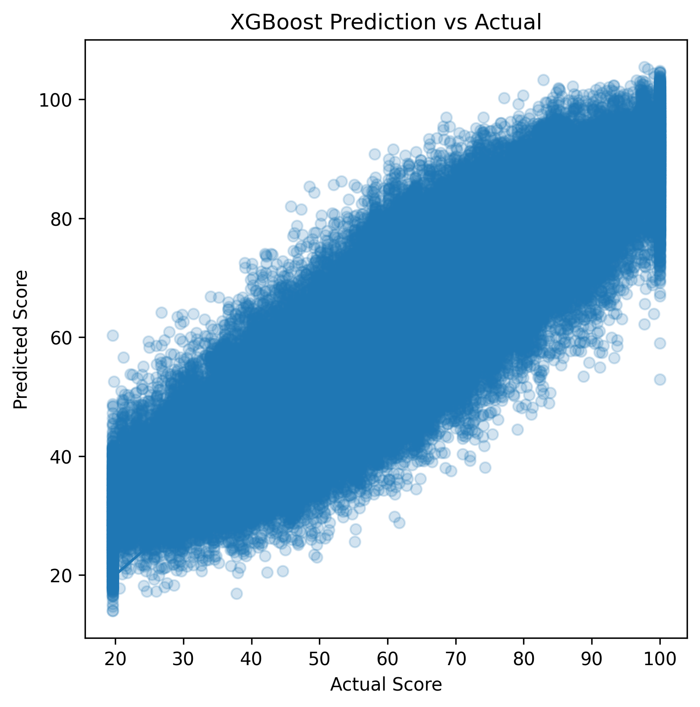
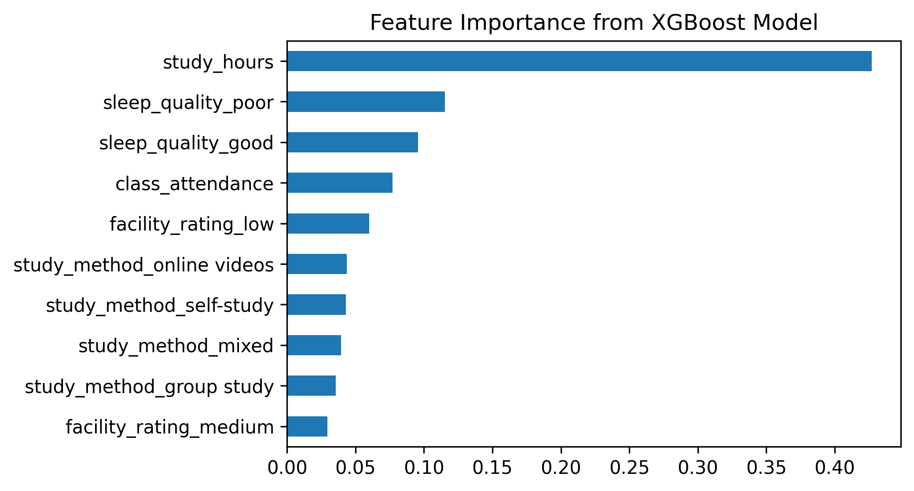
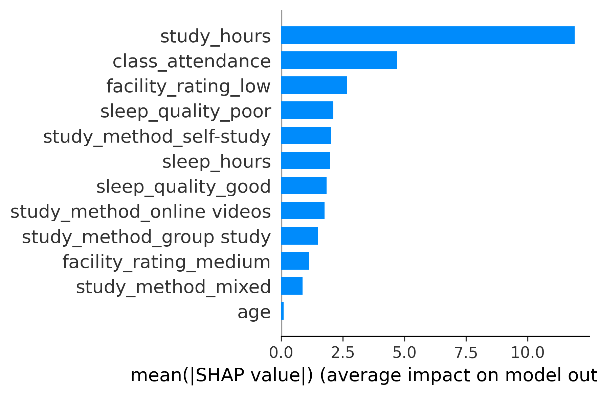

# 学生成绩预测与影响因素分析（回归 + XGBoost）

## 项目概述
本项目使用 Kaggle 数据集来分析影响学生考试成绩的因素，并构建预测模型。  
项目结合了传统计量经济学方法（多元线性回归）与机器学习方法（XGBoost），在保证可解释性的同时提升预测性能。

---

## 项目目标
- 识别影响学生成绩的关键因素  
- 构建并比较回归模型与机器学习模型  
- 提高预测准确性  
- 使用 SHAP 方法进行模型解释  

---

## 核心结果
- XGBoost 模型达到 R² = 0.783，RMSE = 8.79，优于线性回归模型（R² ≈ 0.74）  
- 学习时间、出勤率和睡眠时间是最重要的影响因素  
- 交互项分析表明，不同学习方式下学习时间的影响存在差异  
- SHAP 结果与回归分析一致，验证了关键变量的重要性  

---

## 数据集
- 来源：Kaggle Playground Series (https://www.kaggle.com/competitions/playground-series-s6e1)
- 训练集：约 630,000 条观测  
- 测试集：约 270,000 条观测  

### 主要变量：
- study_hours（学习时间）  
- class_attendance（出勤率）  
- sleep_hours（睡眠时间）  
- study_method（学习方式）  
- facility_rating（教学设施）  
- internet_access（网络条件）  
- exam_difficulty（考试难度）  
- age、gender 等人口学变量  

---

## 方法

### 1. 多元线性回归（OLS）
- 构建多个回归模型并逐步优化  
- 对分类变量使用虚拟变量（dummy variables）处理  
- 加入交互项（interaction terms）以捕捉异质性影响  

#### 主要发现：
- 学习时间、出勤率和睡眠时间对成绩有显著正向影响  
- 教学设施质量对成绩影响较大  
- 不同学习方式之间存在显著差异  
- 交互项表明学习时间的边际效应在不同学习方式下有所不同  

---

### 2. XGBoost 模型
- 使用 XGBoost 回归模型进行预测  
- 将数据划分为训练集与验证集  
- 进行了基础的超参数调优  

#### 模型表现：
| Model | R² |
|------|------|
OLS Regression | ~0.741 |
XGBoost | ~0.783 |

与线性回归模型相比，XGBoost 在预测精度上表现更优。

---

## 模型解释

### SHAP 分析
- 使用 SHAP（Shapley Additive Explanations）解释模型输出  
- 分析特征重要性及其对预测结果的影响方向  

#### 主要结论：
- 学习时间是最重要的特征  
- 出勤率和睡眠时间同样是重要预测因素  
- 学习方式和教学设施对结果也有显著贡献  

---

## 可视化
项目包含以下图表（见 `figures/` 文件夹）：

- 预测值与真实值对比图（Prediction vs Actual）
 
- 特征重要性图（Feature Importance)

- SHAP 总结图（SHAP Summary Plot)

- 其他模型图表详情请见.ipynb文件。

---

## 预测结果输出

模型在测试集上的预测结果已保存为：

- xgboost_predictions.csv

文件包含：
- id：样本标识
- predicted_score：预测成绩

---

## 项目结构

```
student-performance-analysis
│
├── notebooks
│   └── student_performance_analysis.ipynb
│
├── figures
│   ├── prediction_vs_actual.png
│   ├── feature_importance.png
│   ├── shap_summary.png
│
├── results
│   └── xgboost_predictions.csv
│
├── README_ENG.md
├── README_CN.md
├── requirements.txt

```
---

## 项目局限性

尽管本项目在预测性能与模型解释方面取得了较好的结果，但仍存在以下局限性：

- **数据来源限制**：本项目使用的数据来自 Kaggle 平台，属于模拟数据，可能无法完全反映真实教育场景中的复杂性与噪声结构  
- **特征信息有限**：数据集中缺少如家庭背景、心理因素、学校资源差异等潜在重要变量，可能导致模型存在遗漏变量偏差（omitted variable bias）  
- **模型假设约束**：线性回归模型依赖线性关系与误差独立等假设，尽管通过诊断检验（如残差分析）进行验证，但仍可能存在偏离  
- **因果关系限制**：本项目为观察性分析，结果仅能解释变量之间的相关性（association），不能直接推断因果关系（causality）  
- **模型泛化能力**：虽然使用了训练集与测试集进行验证，但模型在其他数据分布或真实应用场景中的表现仍需进一步检验  

---

## 技术栈
- Python（pandas, numpy）  
- statsmodels  
- scikit-learn  
- XGBoost  
- SHAP  
- matplotlib / seaborn  

---

## 声明
本项目使用 Kaggle 公开数据集，仅用于学习与项目展示。

---

## 联系方式
欢迎交流与讨论。
